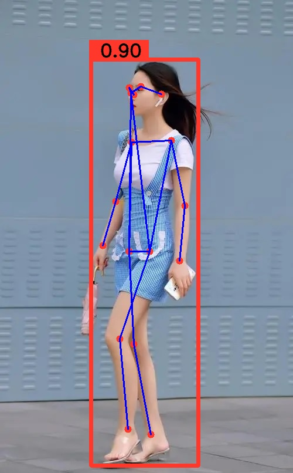

# trtInferModel
基于杜佬的infer框架修改
添加使用tensorrt 推理 resnet 模型、yolov11-pose等模型
持续更新中

## Resnet
```
[infer.cu:251]: Infer 0x55fe06de6b70 [StaticShape]
[infer.cu:264]: Inputs: 1
[infer.cu:269]: 	0.input.1 : shape {1x3x224x224}
[infer.cu:272]: Outputs: 1
[infer.cu:277]: 	0.343 : shape {1x3}
score : 0.997001, label : 2
```

## yolov11 pose


# Reference
- [🌻infer](https://github.com/shouxieai/infer)
